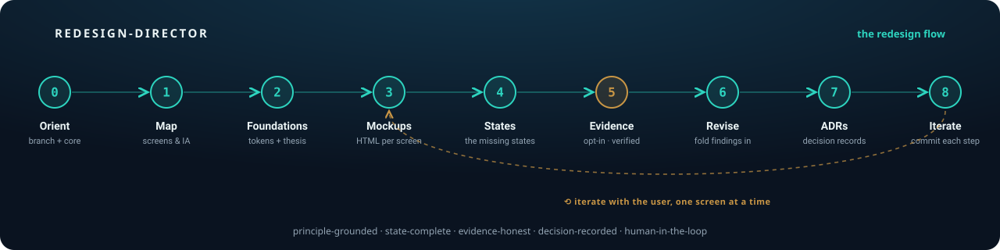

<div align="center">

# redesign-director

**A [Claude Code](https://claude.com/claude-code) skill that runs a disciplined UI/UX _redesign_ — screen by screen — instead of ad-hoc UI tweaks.**

[](LICENSE)
[](https://claude.com/claude-code)


</div>

<p align="center"></p>

---

Most "redesigns" are a pile of taste-based UI tweaks. This one is a **method**: it grounds
every choice in a named principle or cited evidence, designs **every state** (not just the
happy path), records decisions as **versioned ADRs**, and **stops to ask you** at every fork
instead of guessing.

It's a *director*: it **composes** other skills (reasoning, craft, evidence) rather than
reinventing them, and drives an interactive, one-screen-at-a-time process — committing each step.

> Born from a real end-to-end redesign that produced 8 screen mockups, a state matrix, an
> evidence layer, and four versioned ADRs.

## Why you'd want it

- **Principle-grounded, not taste-based** — cites Norman / Cooper / Lupton / Lidwell by name.
- **Evidence-honest** — optional deep-research, and it marks findings *confirmed vs judgment vs refuted*.
- **State-complete** — the missing states (empty, interruption, error, a11y, product-specific arcs) are where real UX lives.
- **Decision-recorded** — versioned ADRs so directions can't silently drift.
- **Human-in-the-loop** — proposes 1–2 cheap alternatives on contested calls; you pick.
- **Cost-aware** — the token-heavy `deep-research` step is opt-in *and* gated by a confirmation hook.

## Quick start

```bash
git clone https://github.com/sahmett/redesign-director.git
cd redesign-director
./scripts/install.sh          # copies skill + subagent + hook into ~/.claude/
```

Then enable the cost-guard hook by merging `settings.snippet.json` into `~/.claude/settings.json`.
In Claude Code:

```
/redesign-director
```

…or just say *"let's redesign these screens"* — it auto-triggers from the skill description.

## The flow

```
0 · Orient      pick branch (redesign vs greenfield) + pin the immutable core (never guess)
1 · Map         inventory screens, IA, existing design system
2 · Foundations tokens, type pairing, component library + a one-line design thesis
3 · Mockups     one principled self-contained HTML file per screen, with inline rationale
4 · States      the missing states (empty, interruption, error, a11y, product-specific arcs)
5 · Evidence    OPT-IN, expensive: offer deep-research with a cost estimate; never auto-run
6 · Revise      fold verified findings in; drop refuted ones; flag judgment vs proven
7 · ADRs        versioned decision records
8 · Iterate     1–2 cheap alternatives per contested control; commit each step
```

**Redesign vs greenfield** — it assumes there's something to redesign. For an empty project it
switches to a *Frame branch* (goals / personas / posture / core idea, with you) before Foundations.
It is **not** meant to auto-run on project open; invoke it when you want a design pass.

**Thin docs?** It won't guess the core: it asks 2–3 framing questions, reads the **code as source
of truth**, drafts the core and confirms it with you, and (if there are no decision records) writes
a lightweight product brief / `ADR-0000` first.

## What's in this repo

| Path | What it is |
|------|-----------|
| `skills/redesign-director/SKILL.md` | The methodology skill (phases, prime directives, house rules) |
| `skills/redesign-director/references/mockup-template.md` | The per-screen mockup contract |
| `hooks/deep-research-cost-guard.sh` | `PreToolUse` hook — warns + asks before the token-heavy `deep-research` workflow |
| `agents/mockup-designer.md` | Optional subagent: produces one screen mockup (keeps the director's context clean) |
| `settings.snippet.json` | Hook config to merge into your Claude settings |
| `scripts/install.sh` | Copies everything into `~/.claude/` |

Everything here is **original**. No third-party skills or copyrighted book text are bundled.

## Requirements

- **Claude Code** — this runs inside Claude Code.
- **Built-in skills (nothing to install):** it composes `artifact-design` (visual craft) and
  `deep-research` (evidence), which ship with Claude Code.
- **Optional external skill:** a UX-principles skill adds a *named-principle citation* layer.
  **Not included, not required** — redesign-director degrades gracefully without it. Install one
  separately if you have one you're licensed to use.

## The cost-guard hook

`deep-research` is powerful but token-heavy (a single run can be ~1–2M tokens / 100+ agents).
The included `PreToolUse` hook intercepts **only** that workflow and asks you to confirm before it
runs; every other workflow passes through untouched. This is the right place for a deterministic
guard — the skill *offers* research with a cost estimate, and the hook makes the gate hard.

## Credits & license

- Attribution (composed built-ins, the external UX skill, and the design literature cited by
  name): see **[CREDITS.md](CREDITS.md)**.
- **[MIT](LICENSE)** — covers the original files in this repo only.

<div align="center">
<sub>Built with <a href="https://claude.com/claude-code">Claude Code</a> · by <a href="https://github.com/sahmett">@sahmett</a></sub>
</div>
